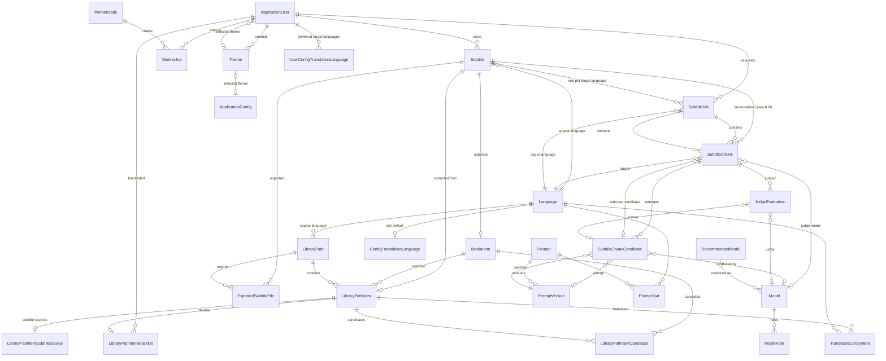

# BCookieSubs Database (PostgreSQL)

BCookieSubs uses PostgreSQL through EF Core. This document describes the domain model, the
strategies behind it (IDs, enums, timestamps, JSONB, soft deletion, retention) and the
index design.

Schema lives in `src/BCookieSubs.Shared/Database`:

- `Entities/` — one file per aggregate area.
- `Configurations/` — one `IEntityTypeConfiguration<T>` per entity (plus JSONB helpers).
- `Seeding/` — seed data (languages, themes, recommended models, prompts).
- `Migrations/` — EF Core migrations.
- `DatabaseSeeder.cs` — idempotent reference-data seeding (runs at startup inside the
  migration advisory lock, so Web and Worker never race and never double-seed).

Authentication and worker tables were the first part of the PostgreSQL schema (ASP.NET Core
Identity `AspNet*` tables + `worker_nodes` / `worker_enrollments` / `worker_credentials`);
the product domain sits next to them.

---

## Conventions

**IDs** — `bigint` identity primary keys throughout (avoids UUID bloat on the
high-volume tables). The only
exceptions are the Identity tables (`AspNetUsers` etc.) which use the long key ASP.NET
Core Identity is configured with, and the `application_config` singleton (`Id = 1`).

**Timestamps** — every timestamp column is `timestamp with time zone`, written in UTC
(`DateTime.UtcNow`). Wall-clock fields that represent *times of day*, not instants
(`schedules.StartTime`, `library_paths.ScanStartTime`) use `time without time zone`,
and recurring days (`DayOfTheWeek`, `ScanDayOfWeek`) are stored as text day names.
Schedules are explicitly UTC wall-clock and the scheduler converts to local time
when evaluating windows.

**Enums** — stable text strings, never integers (e.g. `SubtitleChunkStatus.Queued`
is stored as `"Queued"`). Column values stay readable in SQL.
Renaming a C# enum member would require a data migration, which is the point: enum
values are part of the persisted contract. `System.DayOfWeek` is stored as its text
name as well.

**JSONB** — used only where the value is genuinely structured and schemaless:

| Column | Content |
| --- | --- |
| `worker_jobs.Payload` / `Result` | generic job input/output |
| `media_items.Genres` | `["Action", "Drama"]` |
| `recommended_models.Roles` | `["Translation", "Judge", "NameFormatter"]` |
| `library_path_item_subtitle_sources.Sources` | subtitle-source candidates found by the scanner |
| `application_logs.Metadata` | structured log context |
| `worker_nodes.ReportedCapabilities` / `AllowedCapabilities` / `Hardware` | capability lists, hardware facts |

Everything else that is queried, joined, or constrained stays a real column.

**Unique constraints** — deliberate choices with an eye on PostgreSQL semantics. The
important one:
PostgreSQL treats `NULL` as distinct from `NULL` in unique indexes by default, so
"unique unless both null" keys (e.g. one candidate row per chunk × model × prompt
version, where prompt version may be null) need `NULLS NOT DISTINCT`. The Npgsql EF
provider exposes this as `AreNullsDistinct(false)`; it is used for:

- `models` — unique `("ModelName", "ModelUpdatedAt")`
- `prompt_stats` — unique `(PromptId, PromptVersionId, ModelId, LanguageId)`
- `subtitle_chunk_candidates` — unique `(SubtitleChunkId, ModelId, PromptVersionId)`
  (the candidate upsert key; see below)

**Soft deletion** — only where genuinely required:

| Entity | Soft delete? | Reason |
| --- | --- | --- |
| `Model` / `ModelRole` | yes (`DeletedAt`) | historical chunk/candidate rows keep their model reference meaningful; role assignments are disabled, not destroyed |
| `Subtitle` / `SubtitleJob` | yes (`DeletedAt`, `DeletedByUserId`) | users delete translations; history remains auditable |
| `PromptVersion` | yes (`DeletedAt`) | version text is immutable; rows are disabled, not destroyed |
| users, logs, chunks, candidates, evaluations | no | Identity owns users; logs/candidates have date-based retention; chunks die with their job |

---

## Entity overview

### Identity & permissions

- `ApplicationUser : IdentityUser<long>` — extended with `HasSeenTutorial`,
  `SelectedThemeId`, `ShowPosters`, `Language` (UI locale). No soft delete: Identity
  owns user lifecycle.
- `ApplicationRole : IdentityRole<long>` — extended with `Level` (10 User → 20 SuperUser
  → 30 MasterUser → 40 Admin → 50 Owner; unique index) and `Description`.
  Runtime authorization is role **claims** (claim type `permission`, values are the
  camelCase permission keys such as `canManageWorker`, plus
  `workers.view` / `workers.manage`).
- `permissions` — the catalog as data (label/description/category per key) so an admin
  UI can render it; it is reference metadata, not an authorization lookup.
- First-run setup (`SetupService`) grants the seeded `Owner` role (all 40 permission
  claims) to the created account.

### Reference data

- `themes` — 16 seeded public themes (name unique, 17 color columns).
- `languages` — 94 seeded translation languages, unique `(Iso639, Locale)`;
  ISO 639-1, optional ISO 639-2/B, UI locale, flag.
- `config_translation_languages` — the site-wide default target languages, ordered
  by `Position`; unique per language.
- `user_config_translation_languages` — per-user preferred target languages,
  unique `(UserId, LanguageId)`.
- `models` / `recommended_models` / `model_roles` — configured translation models with
  provider (`Ollama`, `OllamaCloud`, `ChatGPT`, `Claude`, `Copilot`, `Custom`), base
  URL, and role assignments (`Translation`, `Judge`, `FallbackJudge`, `NameFormatter`);
  recommendations are seeded (11 entries). Model deletion is soft.
- `prompts` / `prompt_versions` — prompt templates by kind (`Translation`, `Judge`,
  `NameFormatter`); version texts are immutable, the latest version is the active one.
  8 default prompts seeded as version 1 (`defaultPrompt1..5`, `defaultJudgePrompt`,
  `nameFormatterPrompt`, `theMovieDBMatchingPrompt`).
- `prompt_stats` — per (prompt, version, model, language) request/success/failure/selection
  counters; unique upsert key with `NULLS NOT DISTINCT`.
- `judge_evaluations` — judge decision history per chunk: judge model, the full rendered
  judge prompt (`JudgeInput` — large; see retention), the reason, the selected candidate.
- `schedules` — recurring run windows (day, start time, duration, repeat unit/interval);
  the scheduler is active when enabled rows exist.

### Application state

- `application_config` — singleton row (`Id = 1`) holding general settings (chunk size,
  retries, posters/TMDB, root library path, UI theme, whisper config, log retention).
- `app_secrets` — application-managed secrets (TMDB/LLM API keys) encrypted at rest
  with AES-256-GCM (columns: `Ciphertext`, `Nonce`, `Tag`, `Algorithm`, `SetByEnv`).
  The key is SHA-256 of the `SECRET_ENCRYPTION_KEY` environment value; changing that
  variable invalidates stored secrets. `SetByEnv` marks secrets synced from the
  environment at startup (never overwritten by a later sync if the user set them in
  the UI); env-synced secrets update only when the plaintext actually changed.

### Library

- `media_items` — TMDB-matched or LLM-detected titles (type, year, genres JSONB,
  TMDB id as text, anime tri-state, poster path).
- `library_paths` — scan roots (movie/series), scan schedule (hourly/custom/never with
  day/time/duration), scan state, auto-translate/auto-extract flags, source language.
  Real FK to the source language (`Restrict`).
  Storage mode (`Local`/`Sftp`): SFTP adds host/port/username/auth mode and a pinned
  SSH host-key fingerprint column; credentials are not columns — they live encrypted in
  `app_secrets` (`sftp:<id>:password` / `sftp:<id>:privateKey` / `sftp:<id>:keyPassphrase`).
  Partial unique indexes: `Path` where storage is `Local`, `(SftpHost, Path)` where `Sftp`.
- `library_path_items` — one row per video/standalone subtitle file (season/episode,
  extras, extract filename; unique per path within a library path).
- `library_path_item_blacklist` — 1:1 blacklist with reason and blacklisting user.
- `library_path_item_candidates` — TMDB match candidates per item (unique per item × media).
- `library_path_item_subtitle_sources` — 1:1 scanner cache of available subtitle
  streams/files per item; the `Sources` list (JSONB) holds stream entries with track id,
  language, codec, OCR requirements, entry/picture counts, etc.

### Subtitle pipeline

- `subtitles` — a source subtitle (uploaded, extracted from library, or Whisper-produced)
  plus its transcription workflow state. `OriginalText` holds the entire source file and
  is the single source for chunk materialization. Queue order uses `Priority`
  (lower runs first; sparse values allow insertion).
  Whisper configuration is snapshotted onto the row when the workflow starts.
- `subtitle_jobs` — one translation run per subtitle per target language (unique);
  queue order, chunk bookkeeping (`TotalChunks`/`CurrentChunk`), assembled output text
  and exported file path/hash.
- `subtitle_chunks` — one row per chunk (`ChunkIndex`) with the inclusive source-row
  range (`SrtIdFrom`/`SrtIdTo`). Chunk text is *derived* from `Subtitle.OriginalText`
  by that range and is never stored separately.
- `subtitle_chunk_candidates` — one translation attempt result per
  (chunk, model, prompt version); retries upsert the same row (`NULLS NOT DISTINCT`
  unique key). `TranslatedText` is the row-JSON (`[{"id": 1, "text": "..."}]`),
  `Selected` marks the judge winner.
- `judge_evaluations` — one row per judge decision; `JudgeInput` stores the rendered
  judge prompt for auditability.

#### Candidate retention lifecycle (the growth risk)

Data growth concentrates in `subtitle_chunk_candidates` (non-selected translations)
and `judge_evaluations` (`JudgeInput` snapshots). The intended lifecycle, enabled by the
schema:

- The `(chunk, model, promptVersion)` upsert key keeps retry churn from creating rows.
- Selected candidates are protected: a chunk keeps `SelectedCandidateId`, so cleanup
  can delete non-selected, non-completed candidates of completed jobs by job age.
- `judge_evaluations.JudgeInput` can be nulled or deleted by `CreatedAt` cutoff
  (`JudgeEvaluationRepository.PurgeOlderThanAsync`); decisions themselves are small.
- Retention runs: `application_logs` config-driven retention inside the translation
  runner loop; candidate/eval purges via the explicit maintenance CLI. No further
  schema change is needed.

### Generic worker jobs

- `worker_jobs` — durable persistence for external compute work (OCR, whisper
  transcription). Generic on purpose: `JobType` (stable strings such as
  `ocr`, `whisper.transcribe` — see `Common/WorkerJobTypes`), JSONB `Payload`/`Result`,
  optional `SubjectType`/`SubjectId` (no FK — the dominant entity is referenced
  generically), capability requirement, claim/lease fields (`ClaimedByWorkerId`,
  `ClaimedAt`, `HeartbeatAt`, `LeaseExpiresAt`), retry bookkeeping (`RetryCount`,
  `MaxRetries`, `NextRetryAt` — `MaxRetries = 0` means no auto retry),
  error code/message, progress.
- Claiming uses `FOR UPDATE SKIP LOCKED` (`WorkerJobRepository.ClaimNextAsync`) so
  competing Web/Worker processes cannot claim the same row. Cancellation is C# state;
  workers only ever receive job instructions over gRPC.

### Tracking & logs

- `exported_subtitle_files` — dedupe record for subtitle files written back into a
  library (unique per `(LibraryPathId, Path)`; optional subtitle link, whisper flag).
- `translated_library_items` — marks library items translated per language
  (unique `(LibraryPathItemId, LanguageId)`, detection path, file mtime).
- `application_logs` — durable log with `Level`, event `Type`, optional entity link,
  and JSONB `Metadata`. Retention is date-based hard deletion
  (`LogRetentionEnabled` / `LogRetentionDays` config) — a log row is either present
  or purged; there is no soft delete.

---

## Index design

Deliberate indexes in the schema:

| Table | Index | Query shape |
| --- | --- | --- |
| `subtitles` | `(Status, Priority)`, `OriginalFileHash`, `WhisperTranscriptionState` | dashboard queue, dedupe check, whisper list |
| `subtitle_jobs` | `(Status, Priority)`, unique `(SubtitleId, TargetLanguageId)` | queue ordering |
| `subtitle_chunks` | unique `(SubtitleJobId, ChunkIndex)`, `SubtitleId`, `(Status, StartedAt)` | chunk fetch, per-subtitle lookups, stuck-chunk sweeps |
| `subtitle_chunk_candidates` | unique `(SubtitleChunkId, ModelId, PromptVersionId)` NULLS NOT DISTINCT, `ModelId`, `(Status, UpdatedAt)` | upsert, per-model stats, retention scans |
| `judge_evaluations` | `CreatedAt`, `(ModelId, CreatedAt)` | retention purge, per-model stats |
| `worker_jobs` | `(Status, Priority, CreatedAt)`, `(ClaimedByWorkerId, Status)`, `(SubjectType, SubjectId)` | claiming, per-worker monitoring, subject lookup |
| `application_logs` | `CreatedAt`, `(EntityType, EntityId)`, `Type` | retention purge, entity-log views, type dropdown |
| `library_path_items` | unique `(LibraryPathId, Path)`, `ExtractFileName` | scanner upserts, export naming |
| `library_paths` | unique `Path` where `Local`, unique `(SftpHost, Path)` where `Sftp` | scanner config |
| `media_items` | `TheMovieDbId`, `(Title, Type, Year)` | TMDB match lookup |
| `exported_subtitle_files` | unique `(LibraryPathId, Path)` | dedupe |
| `translated_library_items` | unique `(LibraryPathItemId, LanguageId)` | dedupe |
| `library_path_item_candidates` | unique `(LibraryPathItemId, MediaItemId)` | dedupe |
| `model_roles` | unique `(ModelId, Role)` | one role per model |

---


## Operational notes

- Migrations run automatically at Web/Worker startup under a PostgreSQL advisory lock
  (`DatabaseInitializer`); seeding runs inside the same lock and is insert-if-missing.
- `dotnet ef` works without a running database via
  `Database/DesignTimeDbContextFactory.cs` (honors `ConnectionStrings__Default`).
- Schema changes: add an `IEntityTypeConfiguration<T>`, then
  `dotnet ef migrations add <Name> --project src/BCookieSubs.Shared`.
- Two V2 migrations exist: `V2DomainModel` (the full domain) and
  `V2TranslationLanguages` (additive: the two translation-language tables plus
  two extra indexes).

## Growth and maintenance

The tables that grow without bound are `subtitle_chunk_candidates` (non-selected translations,
the dominant share), `judge_evaluations` (`judge_input` snapshots) and `application_logs`.
`application_logs` retention is config-driven and runs automatically in the translation runner
loop; the other two are cleaned by the explicit maintenance CLI (never automatic):

```bash
dotnet BCookieSubs.Worker.dll db-maintenance                    # defaults: candidate-days 14, judge-days 30
dotnet BCookieSubs.Worker.dll db-maintenance --judge-days 90
```

It deletes non-selected, completed candidates and judge evaluations older than the cutoff in
short batches (no long row locks); selected candidates, failed candidates (error diagnostics)
and recent rows are always kept. PostgreSQL autovacuum reclaims the space afterwards — no
VACUUM step is needed.

## Entity relationship overview

